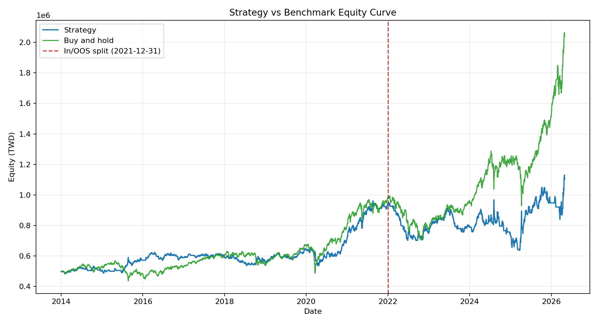
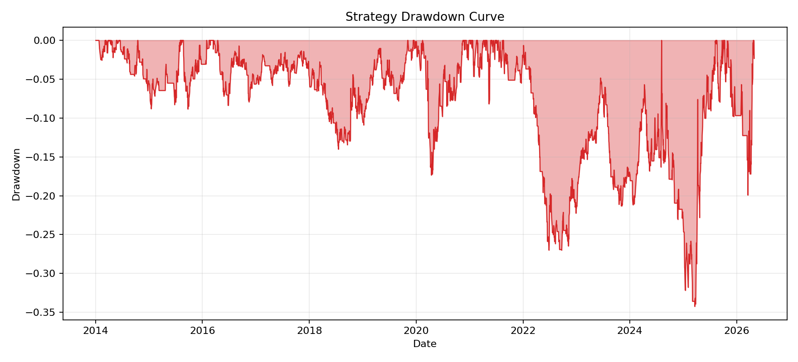
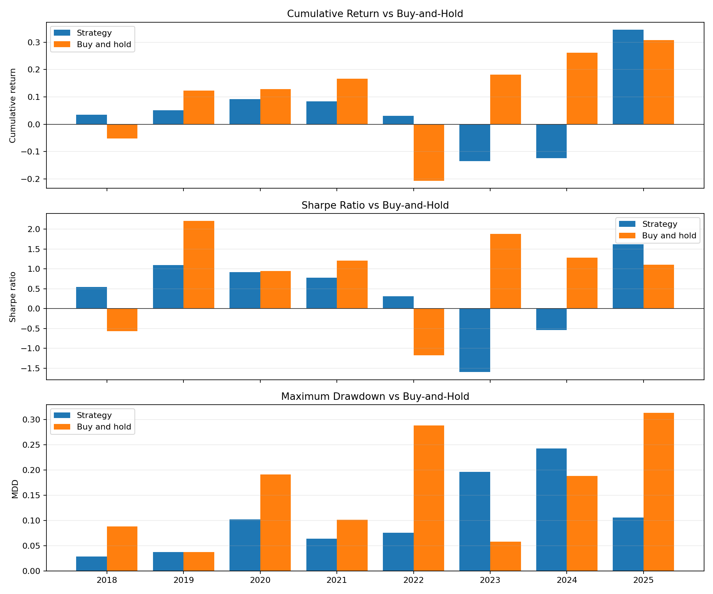
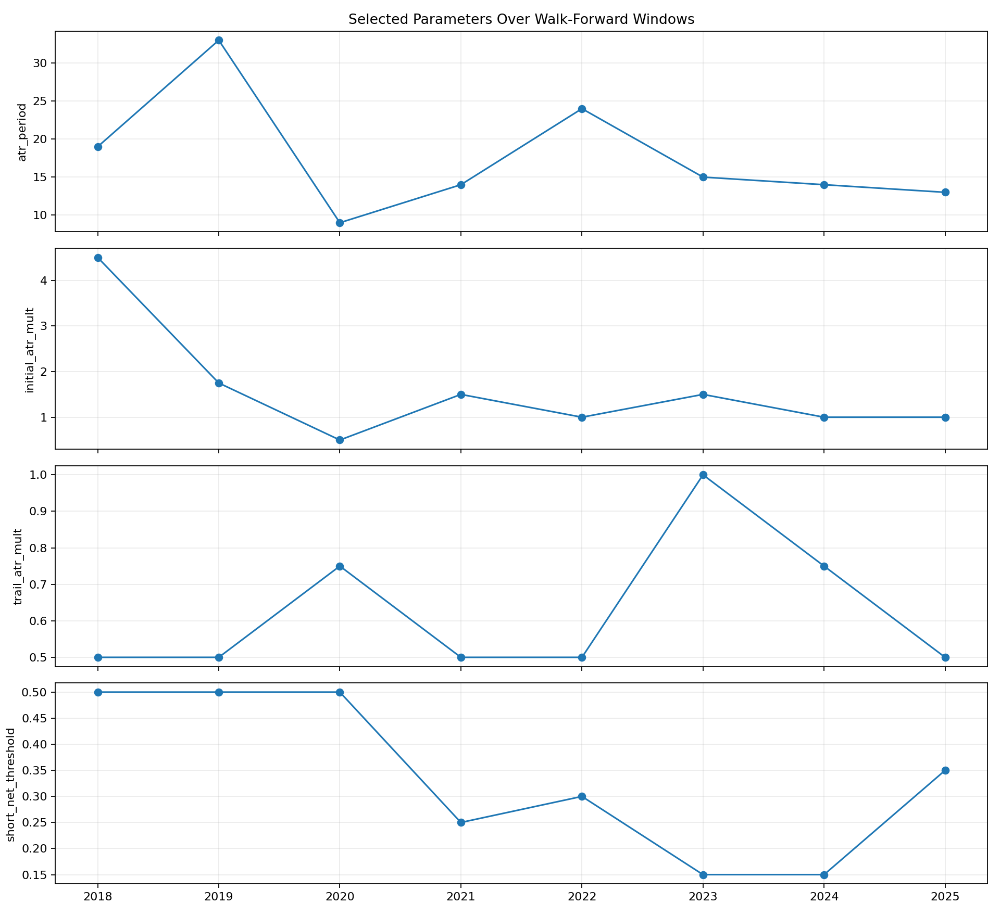
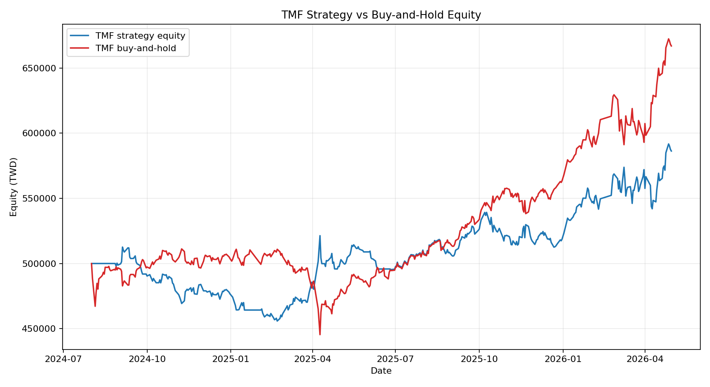
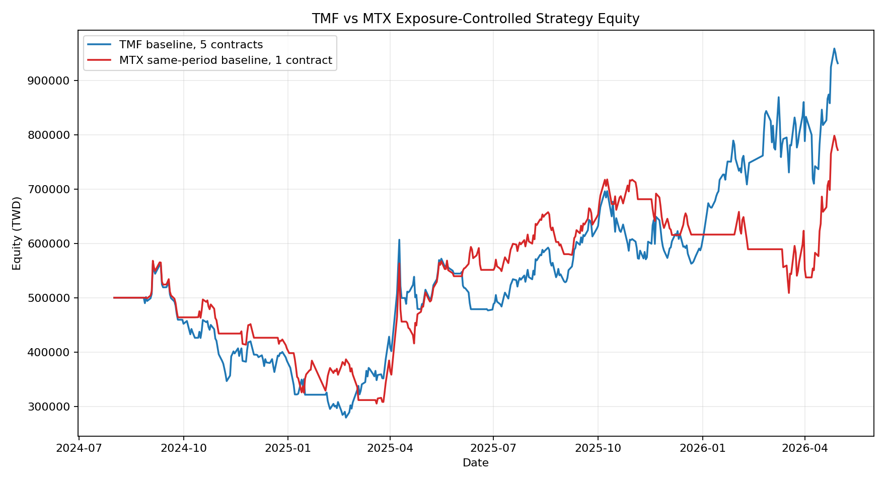
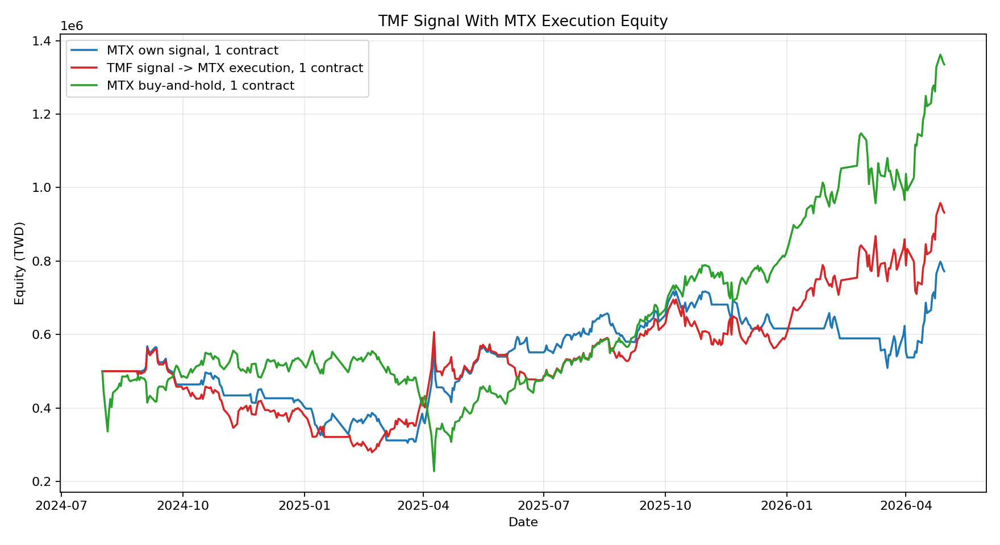

# 散戶多空比反向交易策略研究

> 本專案僅作為量化研究與學習展示，不構成投資建議。公開版本只保留研究摘要、成果圖表與簡報，不包含原始資料、交易明細或完整回測程式碼。

## 快速連結

- [MTX 策略 vs Buy-and-hold](charts/mtx-strategy-vs-benchmark.png)
- [Walk-forward 視窗比較](charts/walk-forward-window-metrics.png)
- [TMF 延伸分析](charts/tmf-equity-curve.png)
- [TMF 訊號、MTX 下單補充](charts/tmf-signal-mtx-execution.png)

## 專案定位

本研究檢驗台指期相關商品中，散戶多空部位變化是否具有反向交易訊號價值。策略並沒有形成穩定 Alpha，而是建立一套能控制 look-ahead bias、納入交易成本、並能用樣本外與 walk-forward 結果檢查策略穩定性的研究流程。

| 項目 | 內容 |
| --- | --- |
| 研究標的 | 小型台指期 MTX、微型台指期 TMF |
| 資料期間 | MTX: 2014-01-02 至 2026-04-30；TMF: 2024-08-01 至 2026-04-30 |
| 主要工具 | Python, pandas, NumPy, Backtrader, Optuna, matplotlib |
| 驗證方法 | In-sample / out-of-sample、buy-and-hold benchmark、rolling walk-forward |
| 風控設計 | 手續費、交易稅、ATR 初始停損、ATR 追蹤停損、資金敏感度分析 |
| 主要結論 | 訊號有部分 timing 行為，但尚未證明具備穩定樣本外 Alpha |

## 方法摘要

策略以散戶多空比與價格變化的背離作為反向交易訊號。訊號在第 t 日收盤後產生，進場在第 t+1 日開盤執行，避免使用同日未來資訊。回測納入交易成本，並使用 ATR 初始停損與 ATR 追蹤停損控制單筆風險。

最新補充測試加入「TMF 生成訊號、MTX 1 口執行下單」情境，用來分離訊號來源與交易商品。

## 主要結果

### MTX Baseline

| 區間 | 策略報酬 | Buy-and-hold | 策略 Sharpe | Benchmark Sharpe | 策略最大回撤 | 交易次數 |
| --- | ---: | ---: | ---: | ---: | ---: | ---: |
| 全期間 | 120.75% | 307.42% | 0.475 | 0.789 | 34.25% | 135 |
| 樣本內 | 88.02% | 95.94% | 0.748 | 0.677 | 17.34% | 83 |
| 樣本外 | 38.01% | 210.86% | 0.395 | 0.896 | 59.79% | 51 |

策略全期間與樣本外皆為正報酬，但大幅落後 buy-and-hold；因此較適合解讀為「可能存在部分 timing 訊號」，不適合包裝成穩定超額報酬策略。

### Walk-forward Testing

Walk-forward 使用 4 年訓練期、1 年測試期，每個視窗只用訓練資料做 Optuna 參數搜尋，測試資料在參數固定後執行一次。

| 指標 | 結果 |
| --- | ---: |
| 測試視窗數 | 8 |
| 平均測試報酬 | 4.74% |
| 正報酬測試視窗 | 6/8 |
| 落後 buy-and-hold 視窗 | 5/8 |
| 最佳化參數打敗 baseline 視窗 | 4/8 |

Walk-forward 結果顯示最佳化未穩定改善樣本外表現，參數穩定性與泛化能力仍是主要限制。

### TMF 延伸分析

TMF 主分析使用固定 1 口，另做 TMF 5 口 vs MTX 1 口的曝險控制比較，因為 TMF 每點 10 元、MTX 每點 50 元。補充測試再把交易商品固定為 MTX 1 口，比較 MTX 原訊號與 TMF 訊號在同一交易商品上的差異。

| 比較 | 報酬 | Sharpe | 最大回撤 | 交易次數 |
| --- | ---: | ---: | ---: | ---: |
| TMF 1 口 baseline | 17.26% | 0.87 | 11.08% | 24 |
| TMF 1 口 buy-and-hold | 33.40% | - | - | - |
| TMF 5 口 baseline | 86.32% | 0.95 | 50.42% | 24 |
| MTX 1 口 same-period baseline | 54.39% | 0.76 | 46.30% | 19 |
| TMF signal -> MTX execution | 86.33% | 0.95 | 50.32% | 24 |

TMF baseline 為正報酬，但樣本短、交易次數少，且績效受少數獲利交易影響明顯，不宜過度解讀。跨商品訊號測試中，TMF 訊號在 MTX 下單的結果高於 MTX 原訊號，但仍落後 MTX same-period buy-and-hold，因此仍不能宣稱具備穩定 Alpha。

## 研究限制

- 策略並未穩定打敗 buy-and-hold。
- Walk-forward 最佳化只在 4/8 測試視窗中打敗 baseline，改善不穩定。
- TMF 樣本期間較短，主分析與跨商品訊號測試皆只有 24 筆交易。
- 尚未納入滑價、保證金、流動性衝擊與動態部位管理。
- 目前是 rule-based strategy 與驗證流程展示，尚未加入機器學習模型。
